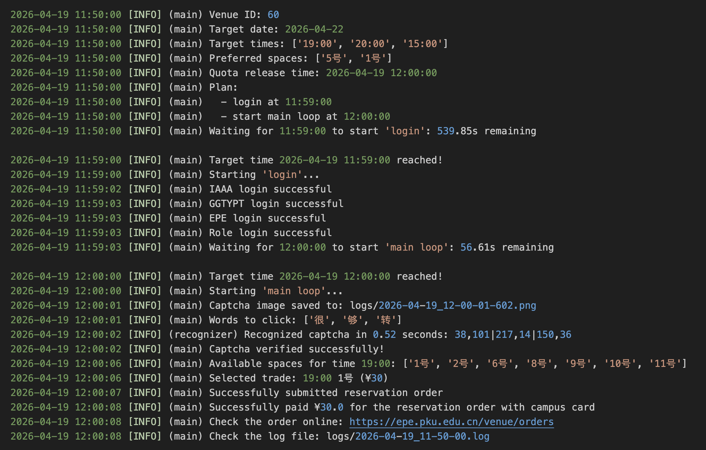

# PKUAutoVenues-2026

```bash
echo 'cd ~/PKUAutoVenues-2026 && \
      uv run main.py \
        --venue qdb \
        --date 2026-04-22 \
        --times 19:00 20:00 15:00 \
        --spaces 5 1' \
    | at 11:50 2026-04-19
```



## 致谢

- [zyHan2077/EpeAutoReserve](https://github.com/zyHan2077/EpeAutoReserve)：大佬的文档为我指点迷津

- [qqworld-tutu/PKUautoBookingVenues-fixed-by-cq-tutu](https://github.com/qqworld-tutu/PKUautoBookingVenues-fixed-by-cq-tutu)

## 配置环境

1. 安装 [uv](https://docs.astral.sh/uv/)

   ```bash
   curl -LsSf https://astral.sh/uv/install.sh | sh
   ```

2. 将项目 clone 到本地

   ```bash
   git clone https://github.com/goudanZ1/PKUAutoVenues-2026
   cd PKUAutoVenues-2026
   ```

3. 修改配置文件

   ```bash
   cp config.sample.ini config.ini
   vim config.ini
   ```

4. 运行项目

   ```bash
   uv run main.py -h
   ```

## 验证码识别

本项目推荐使用 [TT 识图](http://www.ttshitu.com/) 进行验证码识别，一次识别大概耗时 0.5 秒（不走代理），价格为 0.016 元，充值 1 元大约可以识别 62 次。你需要在网站上注册账号（如果已有账号且很久没用的话需要在网站上解锁账号），并在 `config.ini` 的 `[recognize:ttshitu]` 部分填写账号的用户名和密码。

（如果你已经在超级鹰里充了很多钱，）你也可以使用 [超级鹰](https://www.chaojiying.com/) 平台进行验证码识别，你需要在 `config.ini` 的 `[recognize]` 部分将 `method` 的值改为 `chaojiying`，并在 `[recognize:chaojiying]` 部分填写账号的用户名、密码、软件 ID。超级鹰一次识别大概耗时 0.4 秒（不走代理），价格为 0.028 元，一次至少充 19 元（看起来比 [去年](https://github.com/qqworld-tutu/PKUautoBookingVenues-fixed-by-cq-tutu#api) 更坑了）。

## 运行项目

查看帮助信息：

```bash
uv run main.py -h
```

以正确的命令行参数（`venue`, `date`, `times`, `spaces`，其中 `spaces` 是可选的）运行 `main.py` 时，脚本将按如下流程工作，日志保存在 `logs/` 目录下：

1. 根据目标预约日期 `date` 计算出名额释放时间（三天前的中午 12 点）

2. 通过不断轮询，等待到名额释放前 1 分钟，登录智慧场馆系统

3. 等待到 12 点，获取验证码并识别、校验，然后获取当日 `venue` 场馆的预约信息，筛选出空闲的 `(时段, 场地)` 对，并根据 `times` 和 `spaces` 选出其中优先级最高者，提交订单并尝试使用校园卡支付

几个例子：

- 预约 [邱德拔羽毛球场](https://epe.pku.edu.cn/venue/venue-reservation/60) 2026-04-30 的 15:00-16:00 或 20:00-21:00 时段，优先选择 5 号或 6 号场地（5 号和 6 号都不可预约时会随机选择其他可预约场地）：

  ```bash
  uv run main.py \
    --venue qdb \
    --date 2026-04-30 \
    --times 15:00 20:00 \
    --spaces 5 6
  ```

  `venue` 参数填写 qdb / 邱德拔 / 60 都指向邱德拔羽毛球场，60 取的是该场馆的 ID，见上面链接 url

  预约优先级：`15:00 5号` > `15:00 6号` > `15:00 其他场地` > `20:00 5号` > `20:00 6号` > `20:00 其他场地`，成功预约到一场后就退出

- 预约 [五四羽毛球馆](https://epe.pku.edu.cn/venue/venue-reservation/86) 2026-04-30 的 18:00-19:00 时段，随机选择可预约场地（无特别偏好）：

  ```bash
  uv run main.py \
    -v 54 \
    -d 2026-04-30 \
    -t 18:00
  ```

  `venue` 参数填写 54 / ws / 五四 / 86 都指向五四羽毛球馆，对于 ID 54 被占用一事 [邱德拔 121 化妆室](https://epe.pku.edu.cn/venue/venue-reservation/54) 表示没意见

- 预约 [邱德拔台球厅](https://epe.pku.edu.cn/venue/venue-reservation/64)（？）2026-04-30 的 17:00-18:00 时段，优先选择 “斯诺克”（？）或 23 号场地：

  ```bash
  uv run main.py \
    -v 64 \
    -d 2026-04-30 \
    -t 17:00 \
    -s 斯诺克 23
  ```

  `venue` 参数只做了邱德拔羽毛球场和五四羽毛球馆的 alias，如果有预约其他场馆的需求，必须填写场馆 ID，见上面链接 url

## 定时运行

直接 `uv run main.py` 的用法可能只适合名额释放前 10 分钟左右手动执行命令（前台运行），或者前一晚在 `tmux` 里挂着。

如果想要定时运行（一次），可以使用 Linux 的 `at` 命令：

```bash
sudo apt install at

sudo systemctl start atd
sudo systemctl enable atd
```

```bash
echo 'cd ~/PKUAutoVenues-2026 && \
      uv run main.py \
        --venue qdb \
        --date 2026-04-22 \
        --times 19:00 20:00 15:00 \
        --spaces 5 1' \
    | at 11:50 2026-04-19
```

## TODO

- cron
- notify
- preflight
- helper
